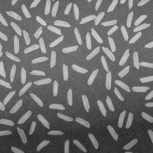
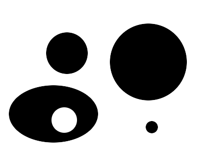
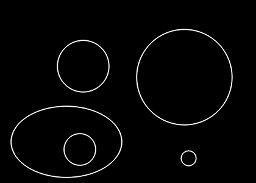
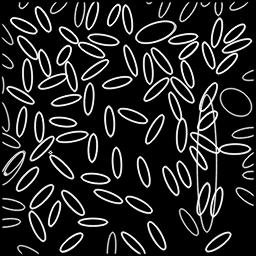
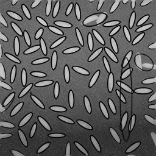

# 实现椭圆拟合

## 3170104142 李翔天

### 要求

> 调用CvBox2D **cvFitEllipse2**( const CvArr* points )实现椭圆拟合.
>
> 
>
> 

### 一、开发说明

#### 1.1 开发环境

-  Windows X64
-  opencv 3.4.5

#### 1.2 运行方式

- FitEllipse.exe input.png

### 二、算法具体步骤

#### 2.1 读取图片

```cpp
Mat src_image = imread(path, 0);
	if (src_image.empty())
		return 0;
```

#### 2.2 使用Canny()将灰度图二值化

```cpp
Canny(src_image, edge_image, 150, 180);
```

#### 2.3 使用findContours()提取轮廓

```cpp
findContours(edge_image, contours, CV_RETR_LIST, CV_CHAIN_APPROX_NONE);//提取图片轮廓
```

#### 2.4 拟合椭圆并使用ellipse()绘制图片

```cpp
RotatedRect box = fitEllipse(point);//椭圆拟合
ellipse(output_image, box, Scalar(255, 255, 255), 1, CV_AA);//绘制椭圆
ellipse(compare_img, box, Scalar(0, 255, 255), 1, LINE_AA);//在原图上绘制椭圆
```

### 三、实验结果

#### 3.1 测试样例1

左图为原图，右图为拟合出的轮廓图



#### 3.2 测试样例2

从左到右依次为：原图，拟合出的轮廓图，轮廓和原图的对比



