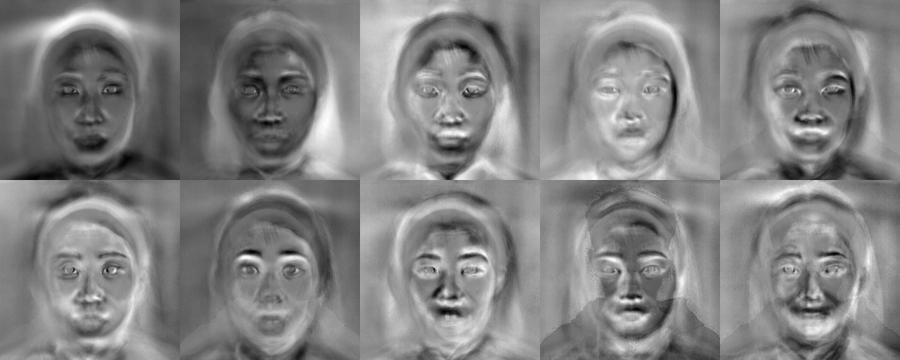
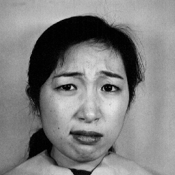
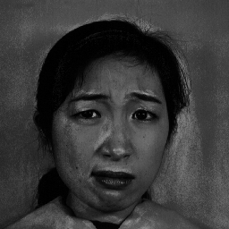
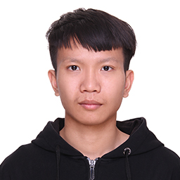
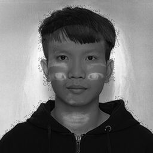

# Eigenface人脸识别算法

## 一、实验内容

自己写代码实现Eigenface人脸识别的训练与识别过程

- 假设每张人脸图像只有一张人脸，且两只眼睛位置已知（即可人工标注给出）。每张图像的眼睛位置存在相应目录下的一个与图像文件名相同但后缀名为txt的文本文件里，文本文件中用一行、以空格分隔的4个数字表示，分别对应于两只眼睛中心在图像中的位置；
- 实现两个程序过程（两个执行文件），分别对应训练与识别
- 训练程序格式大致为：“mytrain.exe 能量百分比 model文件名 其他参数…”，用能量百分比决定取多少个特征脸，将训练结果输出保存到model文件中。同时将前10个特征脸拼成一张图像，然后显示出来。
- 识别程序格式大致为：“mytest.exe 人脸图像文件名 model文件名 其他参数…”，将model文件装载进来后，对输入的人脸图像进行识别，并将识别结果叠加在输入的人脸图像上显示出来，同时显示人脸库中跟该人脸图像最相似的图像。
- 本实验使用了了JAFFE人脸数据库，实验图像的眼睛已经经过统一处理，本试验使用了其中的90%的图片作为训练

## 二、开发说明

### 2.1 开发环境

- Windows X64
- opencv 3.4.5
- VS 2017

### 2.2 运行方式

- 训练模型    mytrainer.exe 0.9 model
- 测试模型    mytester.exe test.tiff model

## 三、算法具体步骤

### 3.1 算法基本思想——主成分分析（PCA）

- EigenFace方法利用PCA得到人脸分布的主要成分，具体实现是对训练集中所有人脸图像的协方差矩阵进行特征值分解，得对对应的特征向量，这些特征向量就是“特征脸”。每个特征向量或者特征脸相当于捕捉或者描述人脸之间的一种变化或者特性。这就意味着每个人脸都可以表示为这些特征脸的线性组合。实际上，空间变换就等同于“基变换”，原始像素空间的基就是单位“基”，经过PCA后空间就是以每一个特征脸或者特征向量为基，在这个空间（或者坐标轴）下，每个人脸就是一个点，这个点的坐标就是这个人脸在每个特征基下的投影坐标。

### 3.2 算法流程

- 训练流程
  1.  将训练集的每一个人脸图像都拉长一列，将他们组合在一起形成一个大矩阵M。
  2. 将所有的K个人脸在对应维度上加起来，然后求个平均，得到了一张“平均脸” AverageFace。
  3. 将N个图像都减去平均脸图像，得到差值图像的数据矩阵M。
  4. 计算协方差矩阵$$S=MM^T$$，再对其进行特征值分解，得到想要的特征向量(特征脸)了。
  5. 将步骤4中得到的K个特征向量中的前P（P=100）个最大的特征值对应的向量取出，作为PCA子空间的一组基。
- 识别过程
  训练过程保存协方差矩阵的前100个特征向量，然后将测试图片读入预处理后，也在这个降维后的P维PCA子空间中找到对应的坐标$$(X_1, X_2, ..., X_P)$$。这里用这个坐标与训练过程得到的K个坐标分别求欧氏距离，即可比对出与测试图片欧氏距离最小的一张人脸，此时完成识别过程。

### 3.3 算法实现细节

#### 训练部分

- **读取图片**。首先根据目录文件读取其中90%的图片作为人脸库测试训练用图，这里测试使用191张人脸库图片+ 1张自己的照片。所有的操作由程序中的`GetFiles`函数实现。

- **图片预处理**。这里采用了先转成灰度图再将直方图均衡化，实现代码如下：

  ```c++
  Mat Equalize(Mat src)
  {
  	Mat g, e;
  	cvtColor(src, g, CV_BGR2GRAY);
  	equalizeHist(g, e);
  	return e;
  }
  ```

- **求样本平均脸**。将图片拉伸为一维向量，对K个向量求平均值

  ```c++
  Mat average;
  X_matrix.col(0).copyTo(average);
  for (int i = 1; i < K; i++) {
  	average += X_matrix.col(i);
  }
  average /= K;
  ```

- **计算协方差矩阵**

  ```c++
  Mat eigenvalues(K, 1, CV_64FC1), eigenvectors(K, K, CV_64FC1);
  //eigen(cov_matrix, eigenvalues, eigenvectors);
  eigen(X_matrix.t() * X_matrix, eigenvalues, eigenvectors);
  eigenvectors = eigenvectors.t();
  
  //calculate real eigen vectors(d*100) d=M*N
  Mat real_eig_vectors(M * N, PREV, CV_64FC1);
  for (int i = 0; i < PREV; i++) {
  	real_eig_vectors.col(i) = X_matrix * eigenvectors.col(i);
  	real_eig_vectors.col(i) /= norm(real_eig_vectors.col(i), NORM_L2);
  }
  ```

- **PCA降维操作**
  我将前100个特征脸保存到文件model中，然后将前10个特征脸显示出来。

  ```c++
  Mat total_eigenface(2 * M, 5 * N, CV_8UC1);
  std::vector<Mat> eigenfaces;
  
  for (int t = 0; t < PREV; t++) {
  	Mat tmpface(M, N, CV_64FC1);
  	//Ttransfer 1D to 2D
  	for (int i = 0; i < M; i++) {
  		for (int j = 0; j < N; j++) {
  			tmpface.at<double>(i, j) = real_eig_vectors.at<double>(i * N + j, t);
  		}
  	}
  	Mat dst, eigenface;
  	normalize(tmpface, dst, 0, 255, NORM_MINMAX);
  	dst.convertTo(eigenface, CV_8UC1);
  	eigenfaces.push_back(tmpface);
  	char str[15];
  	sprintf_s(str, "eface%dth", t);
  	fs << str << tmpface;
  	//start x, y
  	if (t >= 10) {
  		continue;
  	}
  	int startX = t / 5 * M, startY = (t % 5) * N;
  	for (int i = 0; i < M; i++) {
  		for (int j = 0; j < N; j++) {
  			total_eigenface.at<uchar>(startX + i, startY + j) = eigenface.at<uchar>(i, j);
  		}
  	}
  }
  
  //ten eigenfaces shown in one big window
  imshow("Eigenfaces", total_eigenface);
  //write eigenfaces into files
  imwrite("Eigenfaces.jpg", total_eigenface);
  
  ```

  最后得到的效果如下

  

- **将人脸库中的人脸映射到空间A并保存其坐标**

  ```c++
  //calculate the coordinates
  Mat coordinate(PREV, K, CV_64FC1);
  for (int i = 0; i < K; i++) {
  	coordinate.col(i) = real_eig_vectors.t() * (X_matrix.col(i) - average);
  }
  ```

#### 识别部分

- **投影操作**。将目标图像减去平均值，投影到上面的P=100维子空间中，找到目标图像的坐标值，于是我们就可以将该点坐标与训练得到的K张图的坐标作欧氏距离，可以找出最接近的一张脸。当然识别前要先将训练得到的特征向量、平均脸等信息先读进内存。

  ```c++
  //测试部分
  Mat gray = imread(argv[1]);
  //show
  imshow("Origin", gray);
  Mat qry;
  cvtColor(gray, qry, CV_BGR2GRAY);
  Mat line_qry(M * N, 1, CV_64FC1);
  for (int i = 0; i < M; i++) {
  	for (int j = 0; j < N; j++) {
  		line_qry.at<double>(i * N + j, 0) = qry.at<uchar>(i, j);
  	}
  }
  //用向量二范数求欧氏距离
  int min_id = 0;
  double min = norm(query - coordinate.col(0), NORM_L2);
  for (int i = 1; i < K; i++) {
  	double form = norm(query - coordinate.col(i), NORM_L2);
  	if (form < min) {
  		min = form;
  		min_id = i;
  	}
  }
  imshow("Eigenface", src[min_id]);
  //投影
  Mat query(PREV, 1, CV_64FC1);
  query = eigenvectors.t() * (line_qry - average);
  Mat result = Mat::zeros(M, N, CV_64FC1);
  for (int t = 0; t < PREV; t++) {
  	double weight = query.at<double>(t, 0);
  	result += weight * eigenfaces[t];
  }
  result.convertTo(result, CV_8UC1);
  imwrite("result.png", 0.5 * (qry + result));
  ```

- 测试样例

  - JAFFE数据（左边为原图，中图是原图叠加）
    
  - 我自己的脸（左边为原图，中图是原图叠加）
    