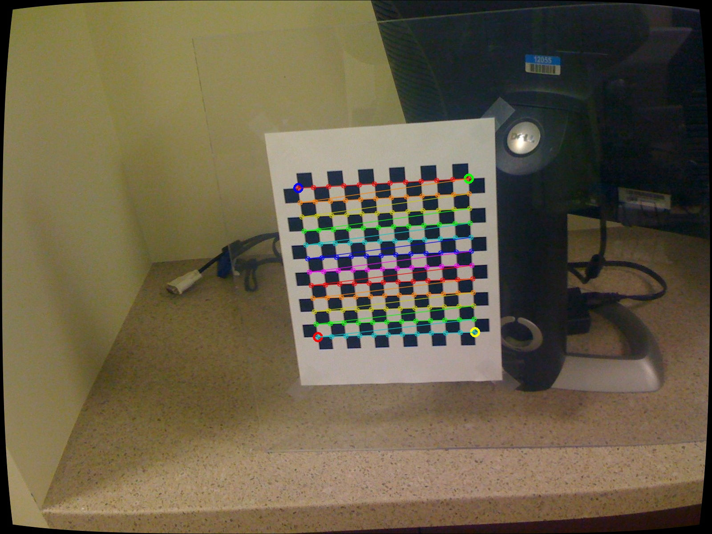
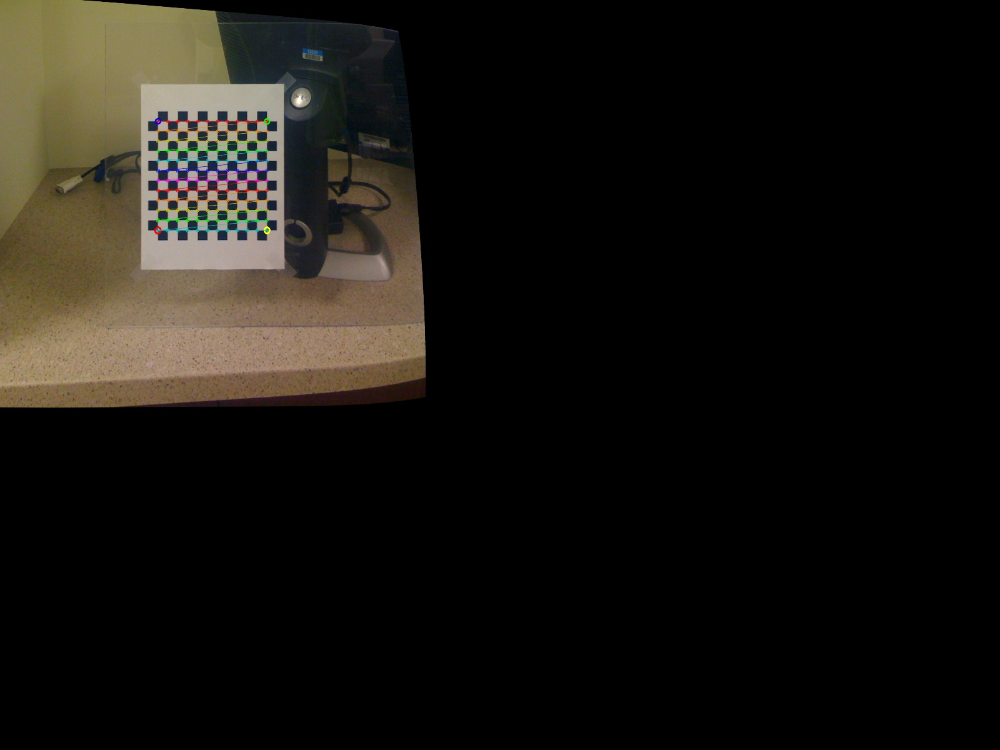
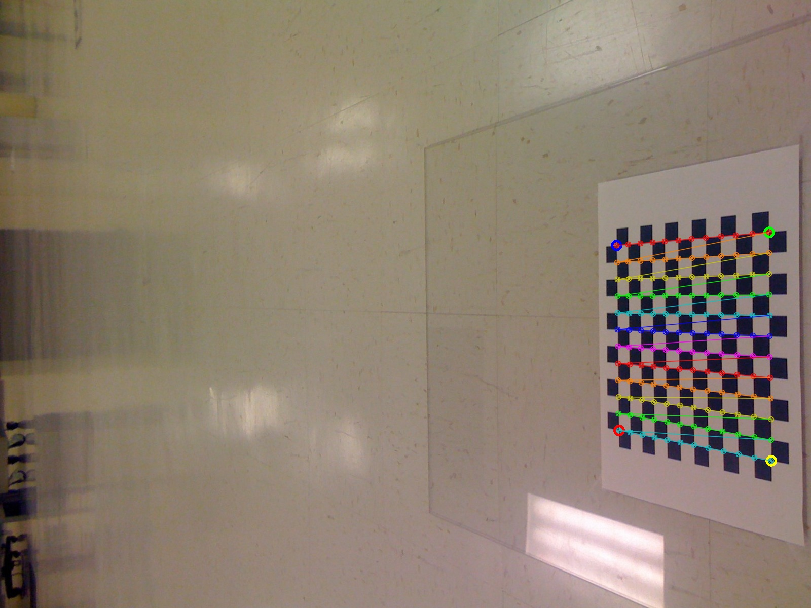
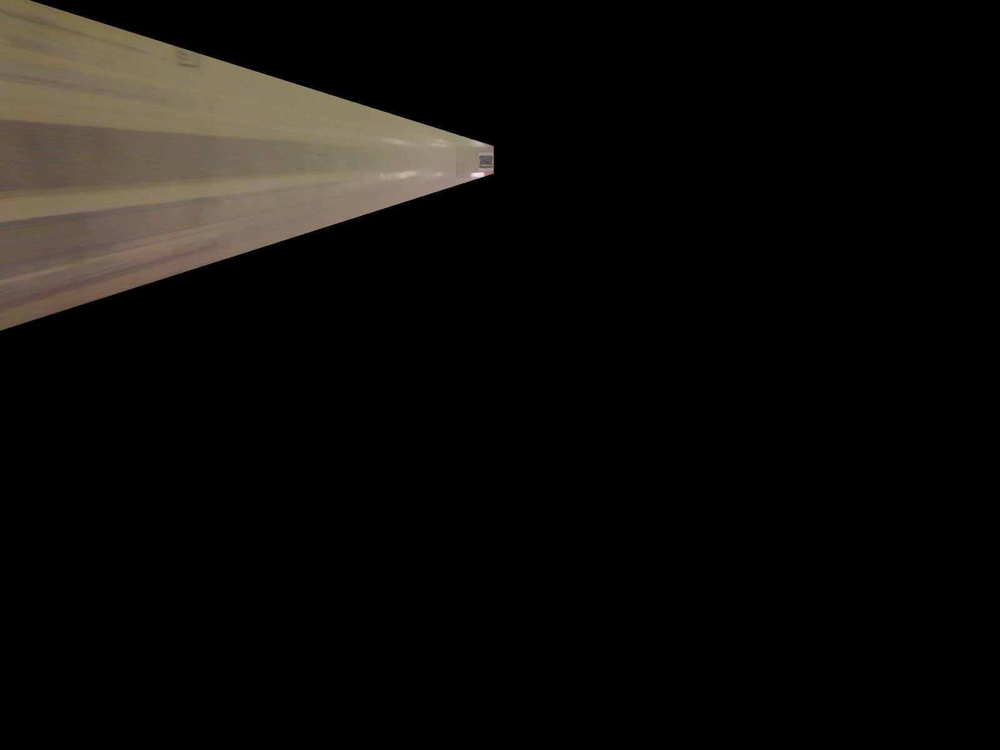
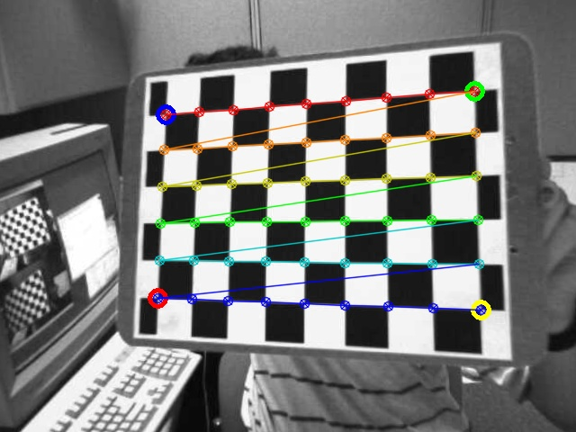
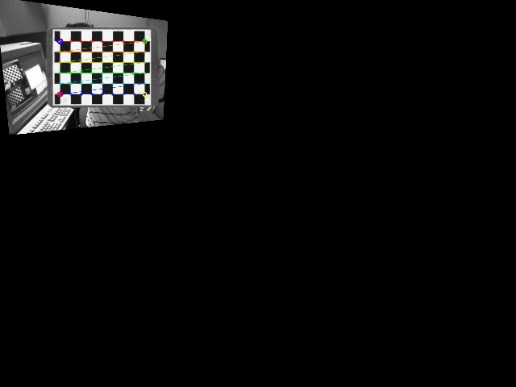

# Calibration + Bird-eye

3170104142	李翔天

## 一、实验内容

- 将Calibration和Bird-eye结合起来
- 实现相机标定和投影

## 二、开发说明

### 1. 开发环境

- Windows X64
- opencv 3.4.5
- VS 2017

### 2. 运行方式

本程序可对三个棋盘数据集进行标定及绘制鸟瞰视图，并生成`intrinsics.xml`文件。

- calibration数据集：Camera_Bird.exe 12 12 23 100 0.5 ./calibration ./test.jpg
- birdseye数据集：Camera_Bird.exe 12 12 28 100 0.5 ./birdseye ./test1.jpg
- stereoData数据集：Camera_Bird.exe 9 6 14 100 1.0 ./stereoData ./test2.jpg

生成图片后，按'd'可下移鸟瞰视图，按'u'可上移鸟瞰视图，按'esc'可退出程序运行。程序运行完成后，会生成两个图片文件。`Checkers.jpg` 是绘制棋盘的图片，`Birds_Eye.jpg` 是鸟瞰视图。

## 三、算法实现

### 1. 棋盘图片的摄像机标定

- 使用glob读取文件夹下的.jpg图片

  ```c++
  String path = folders+"/*.jpg";
  vector<String> filenames;
  glob(path, filenames, false);
  ```

- 使用for循环读取图片，调用`cv::findChessboardCorners`来找到棋盘角点，标出符合条件的图片，并将棋盘绘制图展现出来。如果找到符合条件的图片，则对图片获取内参矩阵`image_points`。

  ```c++
  for (size_t i = 0; (i < filenames.size()) && (board_count < n_boards); ++i) {
      cv::Mat image, image0 = cv::imread(filenames[i]);
      board_count += 1;
      if (!image0.data) {  // protect against no file
          cerr << filenames[i] << ", file #" << i << ", is not an image" << endl;
          continue;
      }
      image_size = image0.size();
      cv::resize(image0, image, cv::Size(), image_sf, image_sf, cv::INTER_LINEAR);
  
      // Find the board
      //
      vector<cv::Point2f> corners;
      bool found = cv::findChessboardCorners(image, board_sz, corners);
  
      // Draw it
      //
      drawChessboardCorners(image, board_sz, corners, found);  // will draw only if found
  
      // If we got a good board, add it to our data
      //
      if (found) {
          image ^= cv::Scalar::all(255);
          cv::Mat mcorners(corners);
  
          // do not copy the data
          mcorners *= (1.0 / image_sf);
  
          // scale the corner coordinates
          image_points.push_back(corners);
          object_points.push_back(vector<cv::Point3f>());
          vector<cv::Point3f> &opts = object_points.back();
  
          opts.resize(board_n);
          for (int j = 0; j < board_n; j++) {
              opts[j] = cv::Point3f(static_cast<float>(j / board_w),
                  static_cast<float>(j % board_w), 0.0f);
          }
          cout << "Collected " << static_cast<int>(image_points.size())
              << "total boards. This one from chessboard image #"
              << i << ", " << filenames[i] << endl;
      }
      cv::imshow("Calibration", image);
  
      // show in color if we did collect the image
      if ((cv::waitKey(delay) & 255) == 27) {
          return -1;
      }
  }
  ```

- 调用摄像机标定函数`cv::calibrateCamera`

  ```c++
  cv::Mat intrinsic_matrix, distortion_coeffs;
  double err = cv::calibrateCamera(
      object_points, image_points, image_size, intrinsic_matrix,
      distortion_coeffs, cv::noArray(), cv::noArray(),
      cv::CALIB_ZERO_TANGENT_DIST | cv::CALIB_FIX_PRINCIPAL_POINT);
  ```

- 至此，我们获得了相机内参数矩阵`intrinsic_matrix`和校正矩阵`distortion_coeffs`，用作下面鸟瞰视图变换的参数。

### 2. 鸟瞰视图变换

- 矫正图像

  ```c++
  cv::initUndistortRectifyMap(intrinsic, distortion,
      cv::Mat(), intrinsic, image_size,
      CV_16SC2, map1, map2);
  ```

- 得到棋盘上的角点

  ```c++
  bool found = cv::findChessboardCorners( // True if found
      image,                              // Input image
      board_sz,                           // Pattern size
      corners,                            // Results
      cv::CALIB_CB_ADAPTIVE_THRESH | cv::CALIB_CB_FILTER_QUADS);
  if (!found) {
      cout << "Couldn't acquire checkerboard on " << file_name << ", only found "
          << corners.size() << " of " << board_n << " corners\n";
      return -1;
  }
  cv::cornerSubPix(
      gray_image,       // Input image
      corners,          // Initial guesses, also output
      cv::Size(11, 11), // Search window size
      cv::Size(-1, -1), // Zero zone (in this case, don't use)
      cv::TermCriteria(cv::TermCriteria::EPS | cv::TermCriteria::COUNT, 30,
          0.1));
  cv::Point2f objPts[4], imgPts[4];
  objPts[0].x = 0;
  objPts[0].y = 0;
  objPts[1].x = board_w - 1;
  objPts[1].y = 0;
  objPts[2].x = 0;
  objPts[2].y = board_h - 1;
  objPts[3].x = board_w - 1;
  objPts[3].y = board_h - 1;
  imgPts[0] = corners[0];
  imgPts[1] = corners[board_w - 1];
  imgPts[2] = corners[(board_h - 1) * board_w];
  imgPts[3] = corners[(board_h - 1) * board_w + board_w - 1];
  ```

- 画图

  ```c++
  cv::circle(image, imgPts[0], 9, cv::Scalar(255, 0, 0), 3);
  cv::circle(image, imgPts[1], 9, cv::Scalar(0, 255, 0), 3);
  cv::circle(image, imgPts[2], 9, cv::Scalar(0, 0, 255), 3);
  cv::circle(image, imgPts[3], 9, cv::Scalar(0, 255, 255), 3);
  
  cv::drawChessboardCorners(image, board_sz, corners, found);
  cv::imshow("Checkers", image);
  cv::imwrite("Checkers.jpg", image);
  ```

- 填充透视变换矩阵的参数

  ```c++
  cv::Mat H = cv::getPerspectiveTransform(objPts, imgPts);
  ```

- 用户调整图片位置和大小，并写入鸟瞰视图

  ```c++
  H.at<double>(2, 2) = Z;
  // USE HOMOGRAPHY TO REMAP THE VIEW
  //
  cv::warpPerspective(image,			// Source image
      birds_image, 	// Output image
      H,              // Transformation matrix
      image.size(),   // Size for output image
      cv::WARP_INVERSE_MAP | cv::INTER_LINEAR,
      cv::BORDER_CONSTANT, cv::Scalar::all(0) // Fill border with black
  );
  cv::imshow("Birds_Eye", birds_image);
  cv::imwrite("Birds_Eye.jpg", birds_image);
  int key = cv::waitKey() & 255;
  if (key == 'u')
      Z += 0.5;
  if (key == 'd')
      Z -= 0.5;
  if (key == 27)
      break;
  ```

## 四、结果展示

### 1. calibration数据集



### 2. birdseye数据集



### 3. stereoData数据集



由上述结果可以看出，该方法对于的相机标定方法表现十分良好。在获取鸟瞰视图上，获取calibration数据集和stereoData数据集测试图像的鸟瞰视图的效果较好，而由于birdseye数据集测试图片的倾斜程度较大，所以其鸟瞰视图表现不如另外两个数据集的测试图像。