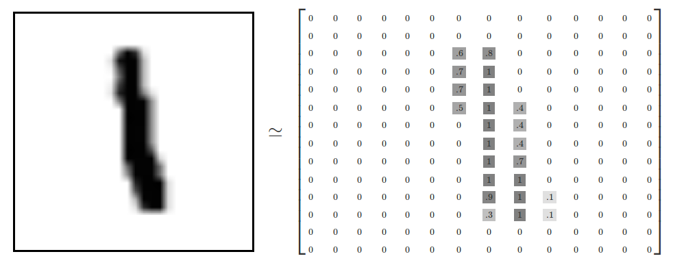
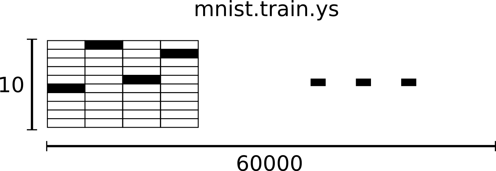
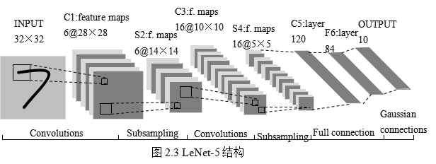
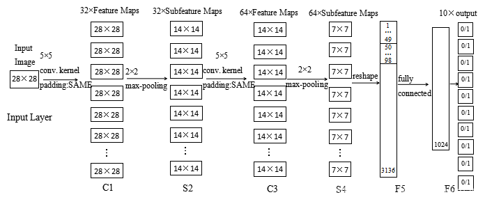
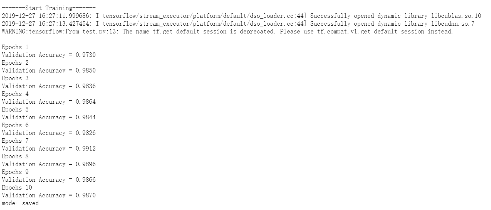
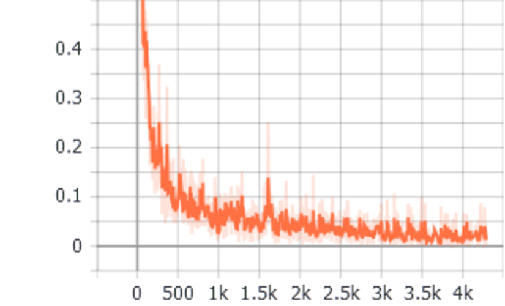
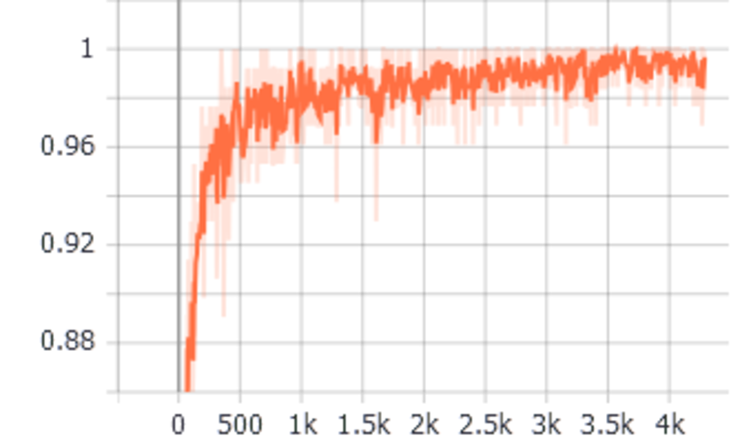
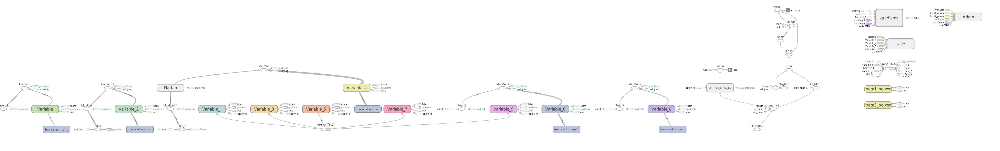
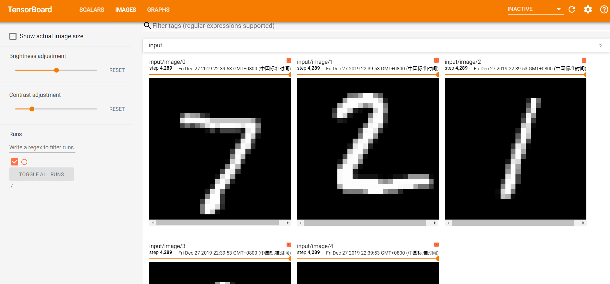
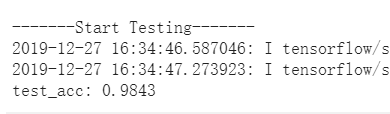

# 光荣题: 学习CNN

3170104142 李翔天

## 一、实验内容

### 利用CNN进行手写数字识别:

框架：TensorFlow（已包含下面网络结构与数据集）
数据集：The Mnist Database of handwritten digits
网络结构：LeNet-5

1. 具体任务：利用上述数据集、网络结构以及选定的TensorFlow框架实现手写数字的识别
2. 提交报告（个人实现过程+结果）

## 二、开发说明

### 1. 开发环境

- Windows X64
- python 3.7.3
- tensorflow 1.14.0

### 2. 运行方式

本程序实现了手写数字识别数据集MNIST的训练和测试，具体运行方式为：

- 训练模型
  - python main.py
  - python main.py True ./MNIST_data
- 测试模型
  - python main.py False ./MNIST_data

其中第一个参数为是否为训练模式，第二个参数为MNIST数据集的文件夹名称，MNIST_data的文件夹结构如下

```
MNIST_data
│   train-images-idx3-ubyte.gz
│   train-labels-idx1-ubyte.gz
|	t10k-images-idx3-ubyte.gz
|	t10k-labels-idx1-ubyte.gz
```

## 三、实现过程

### 1. 加载MNIST数据集

```python
from tensorflow.examples.tutorials.mnist import input_data
mnist = input_data.read_data_sets(data_path, reshape=False)
x_train, y_train = mnist.train.images, mnist.train.labels
x_val, y_val = mnist.validation.images, mnist.validation.labels
x_test, y_test = mnist.test.images, mnist.test.labels
```

每个MNIST图片包含$28\times 28$个像素，如下图表示



每个MNIST的标签为一个one-hot编码的向量，如下图所示



### 2. LeNet-5

 手写数字识别实现使用的是卷积神经网络，主要网络结构为LeNet-5，如下图所示： 



 LeNet-5不包括输入，一共7层，较低层由卷积层和最大池化层交替构成，更高层则是全连接和高斯连接。  

第一个卷积层（C1层）由6个特征映射构成，每个特征映射是一个28×28的神经元阵列，其中每个神经元负责从5×5的区域通过卷积滤波器提取局部特征。 

 S2层是对应上述6个特征映射的降采样层（pooling层）。pooling层的实现方法有两种，分别是max-pooling和mean-pooling，LeNet-5采用的是mean-pooling，即取n×n区域内像素的均值。 

 S2层和C3层的连接比较复杂。C3卷积层是由16个大小为10×10的特征映射组成的，当中的每个特征映射与S2层的若干个特征映射的局部感受野（大小为5×5）相连。 

S4层是对C3层进行的降采样，与S2同理，学习参数有16×1+16=32个，同时共有16×(2×2+1)×5×5=2000个连接。

C5层是由120个大小为1×1的特征映射组成的卷积层，而且S4层与C5层是全连接的，因此学习参数总个数为120×(16×25+1)=48120个。

F6是与C5全连接的84个神经元。网络模型的总体结构如下：



其网络结构代码为

```python
import tensorflow as tf
from tensorflow.contrib.layers import flatten

# x = tf.placeholder(tf.float32, shape=(None, 32, 32, 1))
def LeNet(x):
    mu = 0
    sigma = 0.1
    conv1_w = tf.Variable(tf.truncated_normal(shape=[5,5,1,6], mean=mu, stddev=sigma))
    conv1_b = tf.Variable(tf.zeros(6))
    conv1 = tf.nn.conv2d(x, conv1_w, strides=[1,1,1,1], padding="VALID") + conv1_b
    conv1 = tf.nn.relu(conv1)
    pool_1 = tf.nn.max_pool(conv1, ksize=[1,2,2,1],strides=[1,2,2,1], padding="VALID")

    conv2_w = tf.Variable(tf.truncated_normal(shape=[5,5,6,16], mean=mu, stddev=sigma))
    conv2_b = tf.Variable(tf.zeros(16))
    conv2 = tf.nn.conv2d(pool_1, conv2_w, strides=[1,1,1,1], padding="VALID") + conv2_b

    conv2 = tf.nn.relu(conv2)
    pool_2 = tf.nn.max_pool(conv2, ksize=[1,2,2,1],strides=[1,2,2,1], padding="VALID")

    fc1 = flatten(pool_2)
    fc1_w = tf.Variable(tf.truncated_normal(shape=(400,120), mean=mu, stddev=sigma))
    fc1_b = tf.Variable(tf.zeros(120))
    fc1 = tf.matmul(fc1, fc1_w)+fc1_b
    fc1 = tf.nn.relu(fc1)

    fc2_w = tf.Variable(tf.truncated_normal(shape=(120,84), mean=mu, stddev=sigma))
    fc2_b = tf.Variable(tf.zeros(84))
    fc2 = tf.matmul(fc1, fc2_w) + fc2_b
    fc2 = tf.nn.relu(fc2)

    fc3_w = tf.Variable(tf.truncated_normal(shape=(84,10), mean=mu, stddev=sigma))
    fc3_b = tf.Variable(tf.zeros(10))
    logits = tf.matmul(fc2, fc3_w) + fc3_b
    
    return logits
```

### 3. 图片预处理

- padding操作

  ```python
  x_train = np.pad(x_train, [(0,0),(2,2),(2,2),(0,0)], "constant")
  x_val = np.pad(x_val, [(0,0),(2,2),(2,2),(0,0)], "constant")
  x_test = np.pad(x_test, [(0,0),(2,2),(2,2),(0,0)], "constant")
  ```

- 随机打乱

  ```python
  x_train, y_train = shuffle(x_train, y_train)
  ```

- 将label转为one-hot格式

  ```python
  y_onehot = tf.one_hot(y, 10)
  ```

### 4. 获取损失函数

这里使用了交叉熵来计算损失函数，loss越小，模型越精确，交叉熵具体公式为：
$$
H_{y}(y)=-\sum_{i} y_{i}^{\prime} \log \left(y_{i}\right)
$$

```python
y_onehot = tf.one_hot(y, 10)
logits = LeNet(x)
cross_entropy = tf.nn.softmax_cross_entropy_with_logits(labels=y_onehot, logits=logits)
loss_operation = tf.reduce_mean(cross_entropy)
```

### 5. Adam优化器

使用Adam优化器来进行训练，其中学习率默认为0.001

```python
optimizer = tf.train.AdamOptimizer(learning_rate=learning_rate)
```

### 6. 训练模型

这里使用了batch来训练，其中batch_size的默认大小为128，默认Epochs数为10，具体代码如下

```python
total_batch = int(mnist.train.num_examples/Batch_size)
writer = tf.summary.FileWriter(log_path)
writer.add_graph(sess.graph)
sess.run(tf.global_variables_initializer())
    num_examples = len(x_train)
    print("-------Start Training-------")
    for i in range(Epochs):
        x_train, y_train = shuffle(x_train, y_train)
        for j in range(total_batch):
            begin = j * Batch_size
            end = begin + Batch_size
            # batch_x, batch_y = mnist.train.next_batch(Batch_size)
            batch_x, batch_y = x_train[begin:end], y_train[begin:end]
            _, summ1 = sess.run([training_operation,summ], feed_dict={x:batch_x, y:batch_y})
            # writer.add_summary(summ1, i)
            writer.add_summary(summ1, i * total_batch + j)
        val_acc = evaluate(x, y, x_val, y_val, Batch_size, acc)
        print("Epochs {}".format(i+1))
        print("Validation Accuracy = {:.4f}".format(val_acc))
        saver.save(sess, model_path+"model.ckpt")
    print("model saved")
```

同时，每训练完一个epoch，会获取验证集的准确率，整个训练输出如下



其中，训练过程还使用了tensorboard来进行记录，主要记录训练过程中产生的loss和相应的accuracy。loss和accuracy的图像如下（左图为loss曲线，右图为accuracy曲线）



训练的网络结构图如下



部分数据集图像如下



### 7. 测试模型

使用`tf.train.latest_checkpoint`来读取训练产生的model文件，获取测试集的准确率

```python
print("-------Start Testing-------")
model_file = tf.train.latest_checkpoint(model_path)
saver.restore(sess,model_file)
test_acc = sess.run(acc, feed_dict={x: x_test, y: y_test})
print('test_acc: {:.4f}'.format(test_acc))
```

测试过程及准确率如下



## 四、总结

整个算法的流程为：

1. 确定神经网络结构，使用tensorflow构建网络结构
2. 定义 loss，选定优化器Adam，并指定Adam优化器优化 loss
3. 以batch为单位，迭代地对数据进行训练
4. 在测试集上对准确率进行评价

最后在LeNet模型上能够达到98.4%的精度，可以看出模型的性能是相当不错的，较好的完成了手写数字识别的任务。